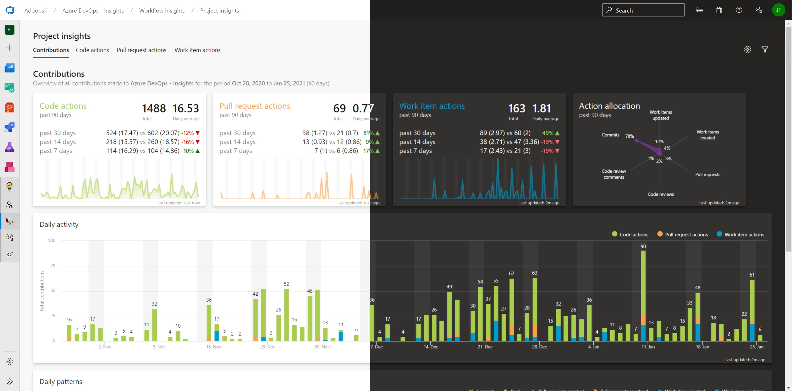

# Adoopsli Support

Understand your team's workflow through data visualisation, metrics and insights within Microsoft Azure DevOps extension.

## Submit bugs and feature requests

When filing GitHub issues, please select the appropriate issue template.

## Billing support

Adoopsli makes use of [Paddle](https://paddle.com) services as the reseller of Adoopsli. Any billing related issue can be submitted via [Paddle support](https://paddle.net).

## Contact us

For additional queries [contact us](mailto:support@adoopsli.com).

## Links

[Guides](https://adoopsli.com/docs/intro)

[FAQ](https://adoopsli.com/docs/faq)

[Privacy policy](https://adoopsli.com/docs/privacy-policy)

[Terms and conditions](https://adoopsli.com/docs/terms)

[Website](https://adoopsli.com)
